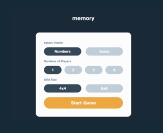

# Frontend Mentor - Memory game solution

This is a solution to the [Memory game challenge on Frontend Mentor](https://www.frontendmentor.io/challenges/memory-game-vse4WFPvM). Frontend Mentor challenges help you improve your coding skills by building realistic projects.

## Table of contents

- [Overview](#overview)
  - [The challenge](#the-challenge)
  - [Screenshot](#screenshot)
  - [Links](#links)
- [My process](#my-process)
  - [Built with](#built-with)
  - [What I learned](#what-i-learned)
  - [Continued development](#continued-development)
  - [Useful resources](#useful-resources)
- [Author](#author)
- [Acknowledgments](#acknowledgments)

**Note: Delete this note and update the table of contents based on what sections you keep.**

## Overview

### The challenge

Users should be able to:

- View the optimal layout for the game depending on their device's screen size
- See hover states for all interactive elements on the page
- Play the Memory game either solo or multiplayer (up to 4 players)
- Set the theme to use numbers or icons within the tiles
- Choose to play on either a 6x6 or 4x4 grid

### Screenshot

### Links

- Solution URL: [Add solution URL here](https://github.com/silasmora/frontend-mentor-memory-game/tree/main/src)
- Live Site URL: [Add live site URL here](https://memory-game-silasmora.netlify.app/)

## My process

### Built with

- Flexbox
- CSS Grid
- Mobile-first workflow
- [React](https://reactjs.org/) - JS library
- [Tailwind CSS](https://tailwindcss.com/) - For styles

### What I learned

Resuable Button Components:
Using reuseable component was a game changer. But knowing how to use them effectively was also a good learning curve for me. Make sure that every prop that's unique to where you're passing that reusable button is actually provided.

Dynamic Styling with Tailwind CSS:
Styled components dynamically using Tailwind CSS classes, creating responsive and visually appealing UI elements and pseudo classes on.

Array Manipulation:
Utilized and re-enforced array methods like sort, filter, and reduce to manage and manipulate player data, finding winners, and handling ties.

Game Logic and Rules:
Designed and implemented the game logic, including finding pairs, tracking scores, determining winners, and handling ties.

### Continued development

### Useful resources

## Author

- Frontend Mentor - [@yourusername](https://www.frontendmentor.io/profile/silasmora)

## Acknowledgments
